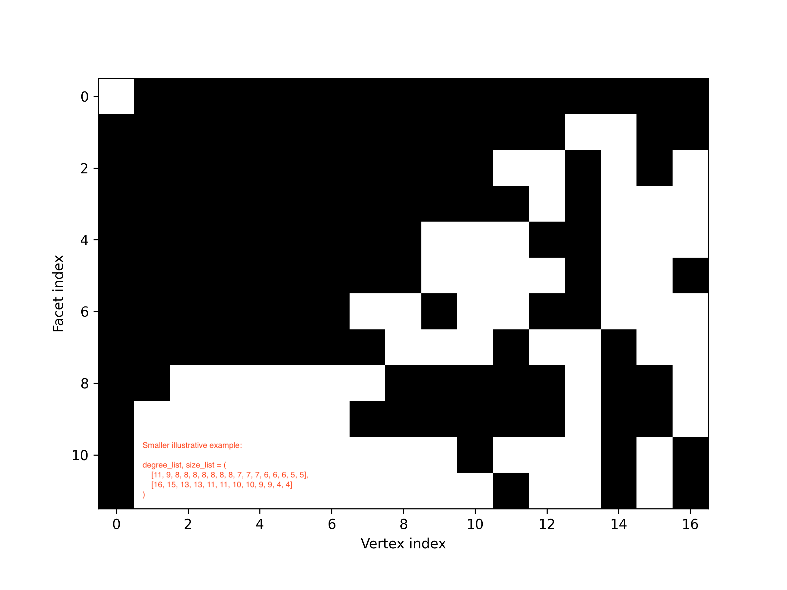
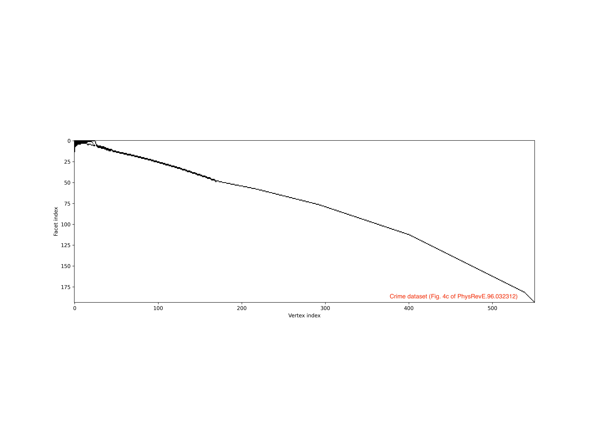

simpliciality_test
==================

.. image:: https://img.shields.io/badge/contact-@oneofyen-blue.svg?style=flat
   :target: https://twitter.com/oneofyen
   :alt: Twitter: @oneofyen
.. image:: https://img.shields.io/badge/license-GPL-green.svg?style=flat
   :target: https://github.com/junipertcy/simpliciality_test/blob/master/LICENSE
   :alt: License

A constructive greedy algorithm to check whether a joint sequence of degree/size distributions is simplicial.

Proof of concept
------------------------------
!!! (Not a randomized algorithm anymore. This section needs to re-write.) !!!

First things first, install the required libraries:

..

    pip install -r requirements.txt

To warm up, try:

..

    python is_simplicial.py -k datasets/00_degs.txt -s datasets/00_sizes.txt

By running the snippet several times, you may notice that the algorithm is not deterministic. 
Indeed, we are building the state space tree with the backtracking algorithm, 
and therefore sampling the ensemble that satisfies the joint degree sequence
(defined by ``00_degs.txt`` & ``00_sizes.txt``). In other words, the joint sequence is simplicial!

The backtracking algorithm is an exhaustive search; 
that is, all feasible solutions are considered and it will always find the optimal solution. 
This means that, unfortunately, our sampling algorithm only works for very small systems.  

We still lack a proper existence test to check whether a joint sequence is simplicial. 
Luckily, when the sequence is simplicial, we do find a greedy deterministic algorithm that picks up an simplicial instance!
This can work in fairly large inputs.

For example,

..

    python is_simplicial.py -k datasets/crime_degs.txt -s datasets/crime_sizes.txt

The dataset is the `crime network dataset`_ from the `Phys. Rev. E paper`_, having 551 nodes and 194 facets.

Moreover, we find that the greedy algorithm can go with two directions,
and sometimes only the "backward direction" work. (TODO: this section has to be re-written)

For example,

..

    python is_simplicial.py -k datasets/02_degs.txt -s datasets/02_sizes.txt

Interesting? I think it is!

Pilot experiments
----------------------
The three figures below show the solution found by the greedy algorithm.

Those black regions denote 1's, whereas white blocks denote 0's.
Theoretically, at a deeper level, we need to avoid more "blocking facets," but as it turned out,
we barely need to avoid any blocking facets at later recursive levels, just because of the greedy construction.

   Fig. 1. Small first example.

   We should note that vertices with higher degree will be paired with larger facets, unless such pairing would prohibit
   a solution. Note also that not any facet is in the subset of another (larger) facet.

The following two datasets come from the inspirational `Phys. Rev. E paper`_. Each of these requires less than 1 second
to compute!

   Fig. 2. Crimes (nodes, n=829) and suspects, victims, and witnesses (facets, f=378) network in St. Louis.

.. figure:: figures/pollinator.png
   :width: 400
   :alt: map to buried treasure

   Fig. 3. Flower-visiting insects (nodes, n=679) and plants (facets f=57) network in Kyoto.

Number of simplicial sequences which partition n
------------------------------------------------
Suppose we have the sequences of degree distribution λ1 and size distribution λ2, each of which partitions n.

Installation
------------
This program is tested on major platforms, including Windows. Please see the corresponding `Travis CI tests`_.

MISC notes (to clean up later)
------------------------------
* The graphical `Erdős–Gallai theorem`_.
* The number of partitions of n (the partition numbers): OEIS:`A000041`_.

Acknowledgement
---------------

.. _`Erdős–Gallai theorem`: https://en.wikipedia.org/wiki/Erd%C5%91s%E2%80%93Gallai_theorem
.. _`crime network dataset`: https://github.com/jg-you/scm/blob/master/datasets/crime_facet_list.txt
.. _`Phys. Rev. E paper`: https://doi.org/10.1103/PhysRevE.96.032312
.. _`A000041`: https://oeis.org/A000041
.. _`Travis CI tests`: https://travis-ci.org/github/junipertcy/simpliciality_test
